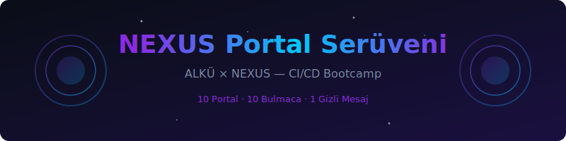

# 🌀 NEXUS Portal Serüveni — CI/CD Bootcamp

<p align="center">
  
</p>

<p align="center">
  <strong>ALKÜ × NEXUS</strong> — Portalları aç, CI/CD'yi öğren!
</p>

---

ALKÜ'nün en parlak mühendisi **Kübra**, NEXUS topluluğunun geleceği için
yeni üyeler arıyor. Meslektaşı **Burak** ile birlikte **10 portal** tasarladılar.
Her portalı geçenler NEXUS'un yeni üyeleri olmaya hak kazanır!

> **⚠️ Kod yazmana gerek yok!** Sadece bulmacaları çöz ve cevapları yaz.

## 🚀 Nasıl Çalışır?

```
Portalı aç → Bulmacayı çöz → Cevabı yaz → git push → Test otomatik çalışır → Tümü doğruysa site deploy olur!
```

## 📋 Hızlı Başlangıç

### 1. Fork Et
Bu sayfanın sağ üstündeki **Fork** butonuna tıkla.

### 2. Klonla
```bash
git clone https://github.com/SENIN-ADIN/bootcamp.git
cd bootcamp
```

### 3. Bağımlılıkları Yükle
```bash
pip install -r requirements.txt
```

### 4. İlk Portalı Aç
```bash
# vakalar/vaka-01.md dosyasını oku (veya GitHub'da aç)
```

### 5. Cevabını Yaz
`cevaplar.py` dosyasını aç, ilgili satıra cevabını yaz.

### 6. Test Et ve Push Et
```bash
pytest --verbose -s                                    # yerelde kontrol et
git add cevaplar.py && git commit -m "Portal 1" && git push  # gönder!
```

### 7. GitHub Pages'ı Etkinleştir
**Settings → Pages → Source → GitHub Actions** seç.

## 🌀 Portallar

| # | Portal Adı | Tür |
|---|-----------|-----|
| 1 | Hoşgeldin Portalı | Ayna yazısı |
| 2 | Sayı Matrisi | Matris + harf-sayı dönüşümü |
| 3 | Makinelerin Dili | Binary (ikili sayı) çözme |
| 4 | Gizli Portal | Gizli dosya keşfi |
| 5 | Koordinat Haritası | Koordinat tablosu |
| 6 | Sezar'ın Portalı | Sezar şifresi |
| 7 | Şiirin Portalı | Akrostiş |
| 8 | Mors Sinyalleri | Mors kodu |
| 9 | Mantık Kapısı | Mantık ve eleme |
| 10 | Son Portal | Meta-bulmaca |

> Sırayla çözmek zorunda değilsin! (Ama Portal 10 için diğerlerini çözmüş olmalısın.)

## 🔄 Çalışma Döngüsü

```
┌─────────────────────────────────────────────────────────┐
│                                                         │
│   1. vakalar/ klasöründen bir portal seç                │
│   2. Bulmacayı oku ve çöz                               │
│   3. cevaplar.py dosyasına cevabını yaz                 │
│   4. git add cevaplar.py && git commit && git push      │
│   5. GitHub Actions sekmesinden sonucu kontrol et       │
│   6. Sonraki portala geç!                               │
│                                                         │
└─────────────────────────────────────────────────────────┘
```

## 🏆 Kazanma Koşulu

**10/10 portal doğru** olduğunda pipeline otomatik deploy eder:

`https://KULLANICI-ADIN.github.io/bootcamp/`

Kübra'nın gizli mesajı ortaya çıkar ve NEXUS'un yeni üyesi olursun! 🌟

---

<p align="center">
  ALKÜ × NEXUS • CI/CD Bootcamp 2026 — Portalları aç, deploy et! 🚀
</p>
